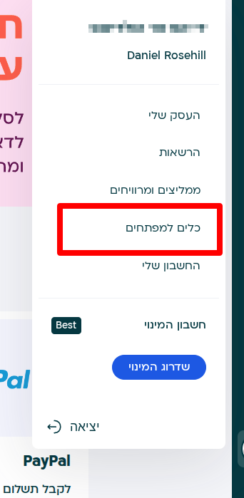
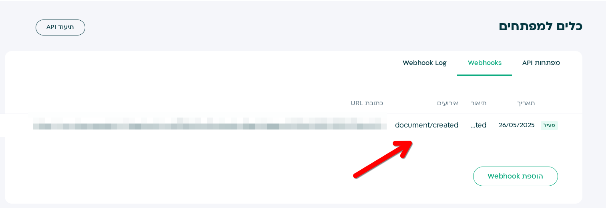
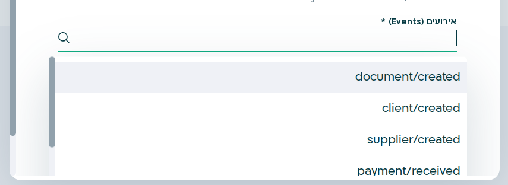
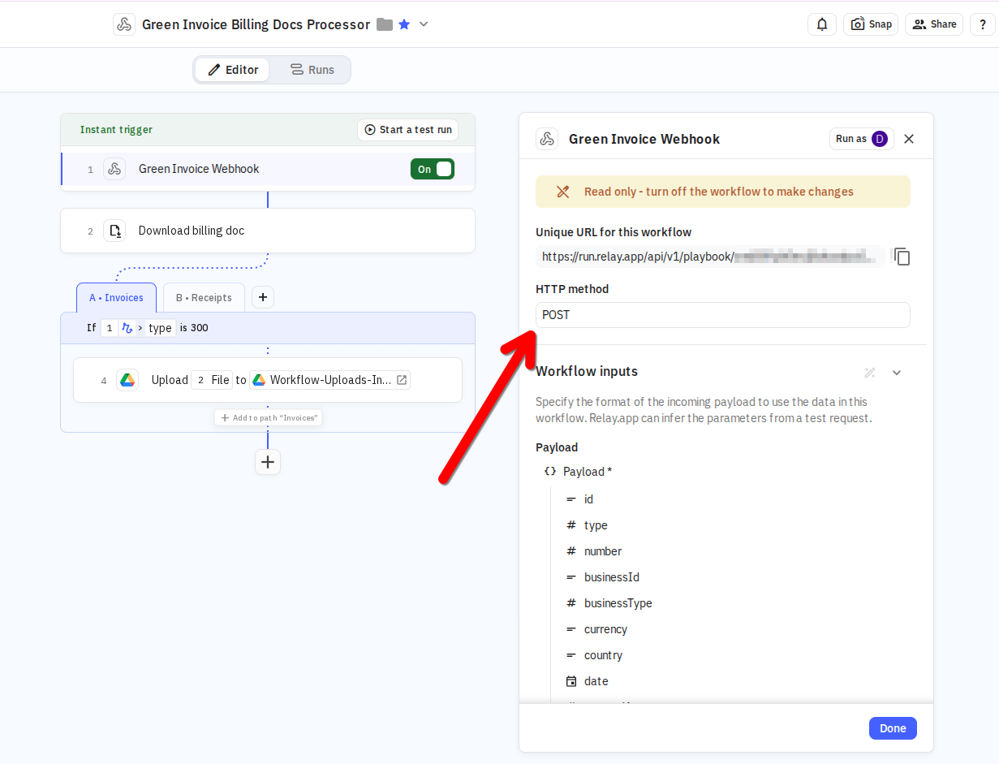

# Using Green Invoice Webhooks for Automation

Green Invoice offers a powerful feature for driving automations via webhooks. This document will guide you through the process of creating and utilizing webhooks within the Green Invoice platform.

## Navigating to Webhooks

To begin using webhooks in Green Invoice:

1. Go to **Settings**.
2. Within **Settings**, select **Developer Tools**.

3. Here, you will have the option to create a webhook.

## Creating Webhooks

Webhooks in Green Invoice can be created for specific document types. When a program generates documents, these webhooks will be triggered automatically. This allows you to automate various processes based on document creation events.

## Webhook Example

For instance, you can set up a webhook that activates when documents are created. Here's an outline of the logic and process:

- **Webhook Trigger**: The webhook is triggered upon the creation of documents.
  
## Application in Relay.app

Within a platform like Relay.app, the following logic applies:

1. **Filtering Node**: A node is created to filter and parse the JSON payload received from the webhook.
   
2. **Document Type Parsing**: The JSON is parsed based on the document type ID.
   
3. **Conditional Routing**:
   - Branches are created for each document type, such as invoices and receipts.
   - Each branch routes the documents to specific folders in a Google Drive.

By using this setup, you can efficiently manage and organize your documents, enhancing your workflow automation with the help of Green Invoice webhooks.